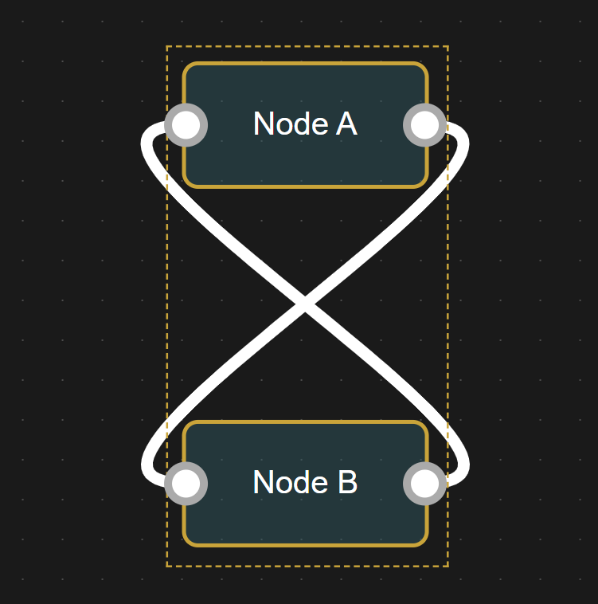

## Yet Another Node-Based Editor

<p align="center">
  <a>
    
  </a>
</p>

### Features
- Infinite grid with pan/zoom
- Auto grid-snapping
- Ultra-smooth feeling UI
- Type-aware nodes

### Examples
You can check out various usage examples located in [`examples`](https://github.com/Mix-Anik/yanbe/tree/master/examples) folder

### Development
- Run `npm i` to install dependencies.

- Create `testing` directory in project root and add `index.html` file with following contents: <details>
  <summary>Show contents</summary>

  ```html
    <!DOCTYPE html>
    <html lang="en">
    <head>
    <meta charset="UTF-8" />
    <title>Testing</title>
    </head>
    <body>
    <div id="editor">
        <div id="viewport">
        <svg id="connections"></svg>
        </div>
    </div>
    <script type="module">
        import { Editor, Node, Connection } from "/src/lib.js";

        const editor = new Editor('editor');
        const nodeA = new Node('Node A', 100, 100);
        const nodeB = new Node('Node B', 300, 250);
        editor.addNode(nodeA);
        editor.addNode(nodeB);
        nodeA.connect(nodeB);
    </script>
    </body>
    </html>
  ```
</details>

- Now you can run `npm run dev` and it will open previously added page in browser which will auto-reload on any code changes.